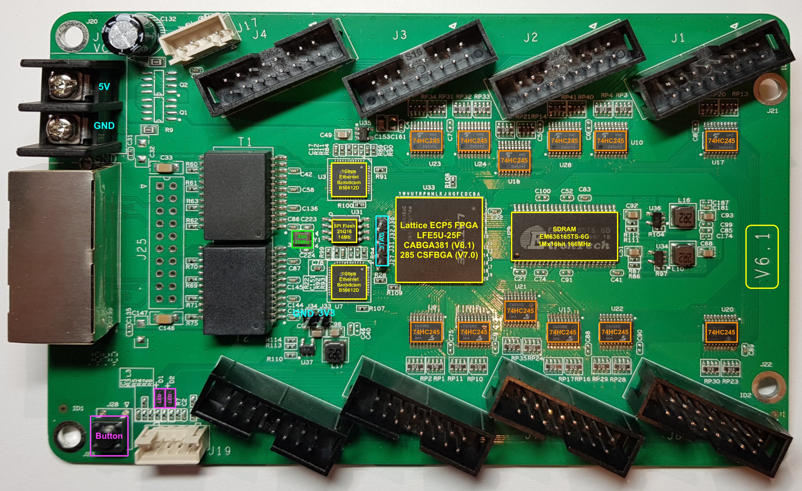

=====================
Preparing your 5A-75B
=====================

The 5A-75B needs to be modified before it can be used as a CNC motion controller.
The most important changes are:

#. Adding pins for flashing the firmware onto the card (JTAG);
#. Removing the buffers.

Especially the last step requires the removal of several SMD-components from the
card and migth require some experience with soldering these types of components.

Board overview
==============

The image below shows an annotated view of the PCB, showing the JTAG-headers and
the buffers. At this moment there are three known versions of these cards: v6.1,
v7.0 and v8.0. The layout of these cards may differ between versions.

The main difference of the V8.0 card is the location of the JTAG-headers. The HUB75HAT
is designed to accept all versions.

Adding JTAG-headers
===================

The JTAG headers are not populated by default. Solder a 2-pin header at J33/J34 and
a 4-pin header for JTAG next to the FPGA (J27, J31, J32, J30). For the function of
each of the pins, see the `hardware description <https://github.com/q3k/chubby75/blob/master/5a-75b/README.md>`.

Removing the buffers
====================

.. warning::
    All buffers on the board convert the 3.3 V from the FPGA to 5V outputs. Leaving
    the wrong buffers on the board might drive the Raspberry-Pi GPIO with 5 V, leading
    to destruction of the Raspberry-Pi. Therefore it is strongly recommended to remove
    all buffers from the 5A-75B. The HUB75HAT is designed to run on 3.3 V and provides
    5V tolerant buffers in order to protect the FPGA.

The buffers can be removed by any of the methods below:

- desoldering;
- cutting the legs of the ICs with a sharp knife and clearing the pads from the
  left-over pins.

One has to be very carefull

