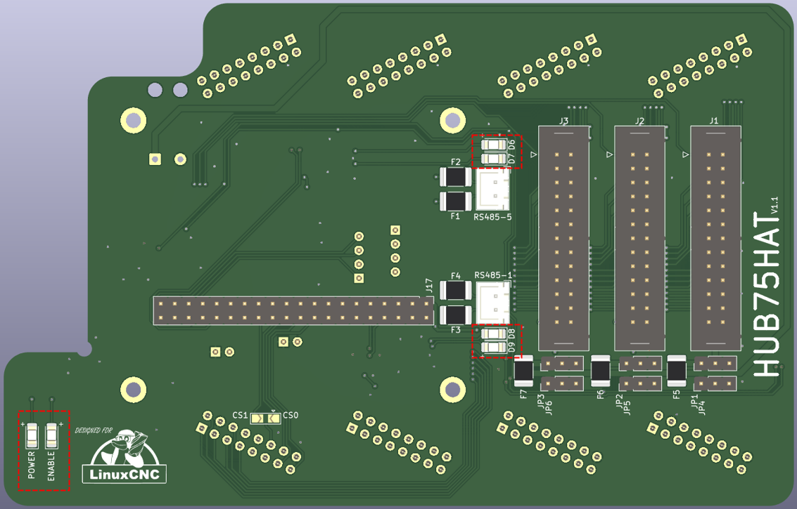

==========
Connectors
==========

Connector locations
===================

The board contains the following connectors:

- power connector for connecting the HUB75HAT and the 5A-75B
- three connectors for I/O (``J1```, ``J2``, and ``J3``). For each connector one can
  select pull-up or pull-down resistors and whether power should be supplied over the
  connector.
- two RS-485 connectors.



Power
=====
The board can be powered in two ways:

- via the USB-C power supply of the RaspberryPi;
- via the external 5V supply of the 5A-75B.

.. warning::
   When the RaspberryPi and 5A-75B are both powered seperately, the link between the
   HUB75HAT and the 5A-75B should not be connected!

In both cases the 5V supply is shared between the RaspberryPi and the 5A75B via
the link in the top left corner of the board and the GPIO header of the Pi. The
pinout of the power header is:

- pin 1 (located closed to the edge of the board): +5V
- pin 2: GND

I/O Connector pinout
====================
Three 26 pin header connectors with standard parallel port pinouts and 5V tolerant 
I/O are provided for compatibility with most parallel port interfaced motion control / 
CNC breakout cards / multi axis step motor drives.

.. note::
    The FPGA used on the 5a-75B has a 3.3V absolute maximum input voltage specification. 
    To allow interfacing with 5V inputs, the HUB75HAT has bus switches on all I/O pins
    to provide 5V tolerance (`SN74CB3T3245 <https://www.ti.com/product/SN74CB3T3245>`_).

    Note that even though the HUB75HAT can tolerate 5V signal inputs, its outputs will not
    swing to 5V. The outputs are push pull CMOS that will drive to the output supply rail of
    3.3V. This is sufficient for TTL compatibility but may cause problems with some types of
    loads. For example when driving an LED that has its anode connected to 5V, in such
    devices as OPTO isolators and I/O module rack SSRs, the 3.3V high level may not
    completely turn the LED off. To avoid this problem, either drive loads that are ground
    referred, Use 3.3V as the VCC for VCC referred loads, or use open drain mode.

.. warning::
    After power-up or system reset and before the FPGA is configured, the per connector
    pull-up or pull-down resistors will pull all I/O signals per connector to a high or 
    low level. If the FPGA is used for motion control or controlling devices that could 
    present a hazard when enabled, external circuitry should be designed so that this 
    initial state results in a safe condition.

.. csv-table:: Connector I/O-1
   :file: ./tables/IO1.csv
   :widths: 12, 12, 12, 12, 4, 12, 12, 12, 12 
   :header-rows: 1

.. csv-table:: Connector I/O-2
   :file: ./tables/IO2.csv
   :widths: 12, 12, 12, 12, 4, 12, 12, 12, 12 
   :header-rows: 1

.. csv-table:: Connector I/O-3
   :file: ./tables/IO3.csv
   :widths: 12, 12, 12, 12, 4, 12, 12, 12, 12 
   :header-rows: 1

Selection pull-up / pull-down
----------------------------- 
Each I/O connector on the HUB75HAT can have its I/O termination resistors set to pull-up
or pull-down mode. These resistors set the I/O voltage level when the pins are not driven
by the FPGA.

.. info::
   It may be desirable with some parallel port type breakout boards to choose the pulldown
   mode, so that the FPGA outputs are in the low state at power up.

Connector 5V power
------------------ 
The HUB75HAT has the option to supply 5V power to the breakout board. This option is
added to simplify wiring. The option uses 4 parallel cable signals that are normally
used as grounds for supplying 5V to the remote breakout board (DB25 pins 22,23,24 and
25). These pins are AC bypassed on both the HUB75HAT and the breakout cards so do not
compromise AC signal integrity.

The 5V power option is individually selectable for each of the three I/O connectors.
The breakout 5V power is protected by per connector PTC devices (300 mA trip) so will
not cause damage to the HUB75HAT or system if accidentally shorted. This option should
only be enabled for breakout boards or boards specifically wired to accept 5V power on
DB25 pins 22 through 25.

RS-485
======

TODO