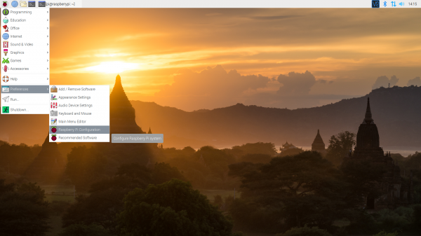
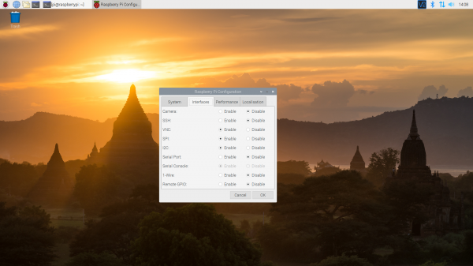
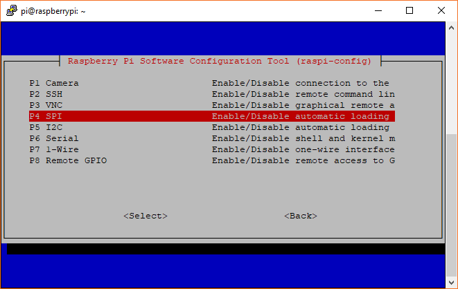

===========================
Preparing your Raspberry-Pi
===========================

This sections describes the steps required to prepare your Raspberry-Pi for running 
LinuxCNC 2.8.4 with the HUB75HAT. You can also choose to use one of the ready-made
images, in which case you can skip these steps. The available images are listed in
the table below.

.. list-table:: Pre-built images for Raspberry-Pi
   :header-rows: 1

   * - Linux version
     - LinuxCNC version
     - username/password
     - link
     - remarks
   * - Debian Buster (32-bit)
     - LinuxCNC 2.8.4
     - cnc/linuxcnc
     - 
     -
   * - Debian Bookworm (64-bit)
     - LinuxCNC 2.9
     - cnc/tuxcnc
     - `link <https://drive.google.com/file/d/1PvfQPvsrcP9Ss2Zrryh35VmkFn31pA4P/view?usp=sharing>`_
     - Read text file on Desktop

Flashing a real-time OS
=======================

Follow these steps to install Debian Buster with a real-time kernel on your
Raspberry-Pi. This recipe has been `posted <https://forum.linuxcnc.org/9-installing-linuxcnc/47841-installing-linuxcnc-2-8-4-on-raspbian-10-buster-tested-on-raspberry-pi-3b-pi?start=0>`_
on the LinuxCNC forum by *elovalvo*.

#. Download from `www.raspberrypi.com <https://www.raspberrypi.com/software/operating-systems/#raspberry-pi-os-legacy>`_
   an image of stable legacy version of Raspberry Pi OS Buster and install to a
   SD card (with Raspberry Pi Imager or similar).
#. Update the OS:

    .. code-block:: bash

        sudo apt update
        sudo apt upgrade

#. Install the realtime kernel (5.15.65-rt49) (source: https://github.com/kdoren/linux/releases):

    .. code-block:: bash

        sudo su     
        cd /tmp     
        wget https://github.com/kdoren/linux/releases/download/rpi_5.15.65-rt49/linux-image-5.15.65-rt49-v7l+_5.15.65-1_armhf.deb     
        apt install ./linux-image-5.15.65-rt49-v7l+_5.15.65-1_armhf.deb     
        KERN=5.15.65-rt49-v7l+      
        mkdir -p /boot/$KERN/o/     
        cp -d /usr/lib/linux-image-$KERN/overlays/* /boot/$KERN/o/     
        cp -dr /usr/lib/linux-image-$KERN/* /boot/$KERN/     
        [[ -d /usr/lib/linux-image-$KERN/broadcom ]] && cp -d /usr/lib/linux-image-$KERN/broadcom/* /boot/$KERN/     
        touch /boot/$KERN/o/README     
        mv /boot/vmlinuz-$KERN /boot/$KERN/     
        mv /boot/initrd.img-$KERN /boot/$KERN/     
        mv /boot/System.map-$KERN /boot/$KERN/     
        cp /boot/config-$KERN /boot/$KERN/     
        cp /boot/cmdline.txt /boot/$KERN/     
        cat >> /boot/config.txt << EOF     

        [all]     
        kernel=vmlinuz-$KERN     
        # initramfs initrd.img-$KERN     
        os_prefix=$KERN/     
        overlay_prefix=o/$(if [[ "$KERN" =~ 'v8' ]]; then echo -e "\narm_64bit=1"; fi)     
        [all]     
        EOF

#. Optimizing kernel (source: https://gnipsel.com/linuxcnc/rpi4-11-emc.html) by opening ``cmdline.txt``

    .. code-block:: bash

        sudo nano /boot/$KERN/cmdline.txt

   And adding ``isolcpus=,2,3 idle=poll`` to the end of the string. To close the file, press
   ``Ctrl+X``, ``y`` and ``Enter``.

We recommend restarting your Raspberry-Pi to ensure that the changes to take effect.

Installing LinuxCNC
===================

Follow these steps to install LinuxCNC 2.8.4. This recipe has been `posted <https://forum.linuxcnc.org/9-installing-linuxcnc/47841-installing-linuxcnc-2-8-4-on-raspbian-10-buster-tested-on-raspberry-pi-3b-pi?start=0>`_
on the LinuxCNC forum by *elovalvo*.

#. Add the LinuxCNC Archive Signing Key to your apt keyring

    .. code-block:: bash

        sudo apt-key adv --keyserver hkp://keyserver.ubuntu.com --recv-key 3cb9fd148f374fef

#. Add the apt repository (`link <http://linuxcnc.org/docs/html/getting-started/getting-linuxcnc.html#_installing_on_debian_buster_with_preempt_rt_kernel>`_):

    .. code-block:: bash

        echo deb http://linuxcnc.org/ buster base 2.8-rtpreempt | sudo tee /etc/apt/sources.list.d/linuxcnc.list
        echo deb-src http://linuxcnc.org/ buster base 2.8-rtpreempt | sudo tee -a /etc/apt/sources.list.d/linuxcnc.list

#. Update the package list from linuxcnc.org and install LinuxCNC

    .. code-block:: bash
        
        sudo apt-get update
        sudo apt-get install linuxcnc-uspace linuxcnc-uspace-dev

Installing LiteX-CNC
====================

Litex-CNC can be installed using ``pip``:

.. code-block:: bash
    
    pip3 install litexcnc[cli] --user

.. note::
    The suffix ``[cli]`` is required to install the command-line interface. Without
    this suffix the scripts referenced in this documentation will not work.

To install the Litex-CNC driver for LinuxCNC, use the following command:

.. code-block:: bash
    
    sudo env "PATH=$PATH" litexcnc install_driver

Optionally, one can also install the toolchain required to build the firmware on the
Raspberry-Pi. When this step is omitted, the firmware has to be compiled on a different
computer.

.. code-block:: bash
    
    litexcnc install_toolchain --user --architecture arm --os linux

.. note::
    This description is specific for Debian Buster, which is a 32-bit operating system.
    When using a newer version of Debian, it might be a 64-bit version, in which case
    the switch ``--architecture arm64`` should be used instead. You can check whether
    you have a 32-bit or a 64-bit operating system by running ``uname -a`` in the terminal.

Enabling SPI
============

The SPI peripheral is not turned on by default. There are two methods to adjust
the settings, either by using the command-line (``raspi-config``) or by using the
GUI.

Using the Desktop GUI
---------------------

You can use the Desktop GUI by heading to the **Pi Start Menu** > **Preferences** > 
**Raspberry Pi Configuration**.

A window will pop up with different tabs to adjust settings. What we are interested
is the Interfaces tab. Click on the tab and select Enable for SPI. At this point, you
can enable additional interfaces depending on your project needs. Click on the OK
button to save.

We recommend restarting your Pi to ensure that the changes to take effect. Click on 
the **Pi Start Menu** > **Preferences** > **Shutdown**. Since we just need to restart,
click on the Restart button.

Using the command-line
----------------------

If you are using a terminal, you will need to:

#. Run ``sudo raspi-config``.
#. Use the down arrow to select 5 Interfacing Options
#. Arrow down to ``P4 SPI``.
#. Select yes when it asks you to enable SPI,
#. Also select yes if it asks about automatically loading the kernel module.
#. Use the right arrow to select the <Finish> button.
#. Select yes when it asks to reboot.

The system will reboot. When it comes back up, log in and enter the following command:

.. code-block:: bash

    ls /dev/*spi*

The Pi should respond with::

    /dev/spidev0.0  /dev/spidev0.1

These represent SPI devices on chip enable pins 0 and 1, respectively. These pins are
hardwired within the Pi. Ordinarily, this means the interface supports at most two 
peripherals, but there are cases where multiple devices can be daisy-chained, sharing
a single chip enable signal.

Enabling UART
=============
THe HUB75HAT has two RS-485 connectors, which are powered by the RaspeberryPi UARTs 
0 and 5. To use the RS-485 communication additional steps are required.

UART0
-----

.. info::
    Enabling UART5 is easier than enabling UART1. It is only recommended to enable UART0
    when two RS-485 connections are required.

By default, the primary UART is assigned to the Linux console. If you wish to use the
primary UART for other purposes, you must reconfigure Raspberry Pi OS. This can be done
by using raspi-config:

#. Start raspi-config: ``sudo raspi-config``.
#. Select option 3 - Interface Options.
#. Select option P6 - Serial Port.
#. At the prompt *Would you like a login shell to be accessible over serial?* answer 'No'
#. At the prompt *Would you like the serial port hardware to be enabled?* answer 'Yes'
#. Exit raspi-config and reboot the Raspberry Pi for changes to take effect.

To switch the Bluetooth function to use the mini UART, and makes the first PL011 (UART0) 
the primary UART, add the following lines to ``/boot/config.txt``:

.. code-block::

    enable_uart=1
    dtoverlay=miniuart-bt
    core_freq=250

After rebooting the RaspeberryPi, one can check the whether messages can be sent using UART0
by sending a test-message:

.. code-block:: shell

   sudo echo "Hello world" > /dev/ttyAMA0

Sometimes one can experience ``Permission denied`` problems when executing the command above. In
this case there is most likely another process using UART0. One can disable this service by running
the following command and rebooting the RaspberryPi.

.. code-block:: shell

    sudo systemctl disable serial-getty@ttyAMA0.service

UART5
-----
UART5 is located on GPIO pins 12 (RX) and 13 (TX). To enable UART5 add the following
line to ``/boot/config.txt``:

.. code-block::

    dtoverlay=uart5

UART5 can be found under ``/dev/ttyAMA1``.

Example usage
-------------
An example usage of the UARTs is the `non-realtime component for Huanyang VFDs <https://linuxcnc.org/docs/html/man/man1/hy_vfd.1.html>`_.

.. code-block::
    
    hy_vfd --device /dev/ttyAMA1
