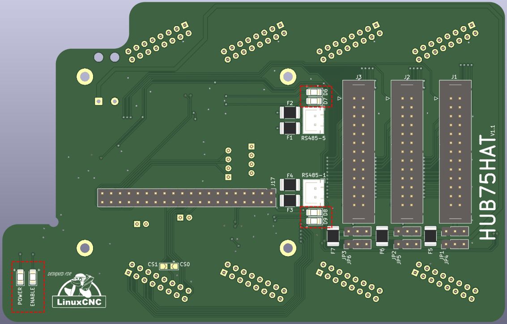

===========
Status LEDs
===========

LED locations
=============

The board has three groups of status LEDs:

#. Power and ENA on the bottom-left;
#. TX/RX for RS-489 connnection 1 (UART0)
#. TX/RX for RS-489 connnection 5 (UART5)

Power, ENA and ESTOP
====================
The power indicator is on when power is supplied to the HUB75HAT (either by the RPi or the
5A-75B). When this LED is on, **DO NOT** unplug the GPIO connector, as this may lead to 
irreversible damage to the RPi and/or 5A-75B.

The ENA indicator is on when the board got the _enable_ command from LinuxCNC. When this LED 
is on, signals from the 5A-75B will flow to the three I/O connectors. It is strongly recommended
not to change connections from the I/O, as this may result in damage or unexpected movement of
the machine.

.. warning::
    In version 1.0 the ENA-LED is not working.

TX/RX status LEDs
=================
Both RS-485 connectors have two LEDs indicating communication to and from the port.
