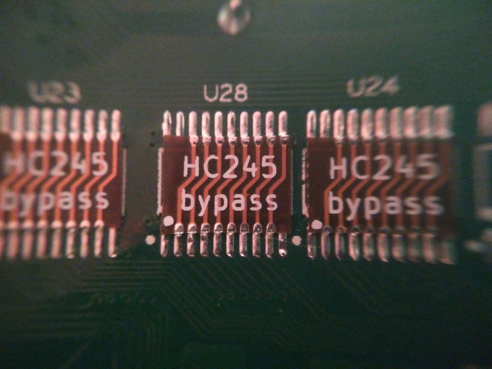

# `hc245t-bypass`

This tiny board is useful to replace 74HC245T chips on Colorlight 5A-75B and 5A-75E boards.

Don't forget to select Flex board type on the order page!

## Rework

The board needs some rework to improve solderability. It's also possible to solder it "as is", but you can encounter shorts between the adjacent pins.

First, separate the boards from a panel. This can be done easily with scissors.

Next, cut each board by the line marked in red. The line should be on the edge of each via, not on the center. Try to make the line as straight as possible. The idea is to cut as much copper as possible, avoiding cutting most of the via copper.

Now solder it! Note that the first "pin" on the flex board corresponds to the second pin of the 74HC245T footpint.

You can also skip soldering about 50% of 74HC245T footprints by skipping footprints that are used for common signal (like A-E, CLK, LATCH, BLANK) distribution. You can learn in advance which footprints you need to solder and which not. Usually "color" signals are distributed through separate 74HC245T buffers located in groups of 3. Of course, this way you will not be able to control 8 signals out of... many, but it's still a good price for not soldering ~50% of tiny boards.

Additionally, you can use a continuity tester to check that all "data" pins are connected and adjacent pins are not shorted accidentally. Some of the 74HC245T footpints used for common signal distribution have some of the pins connected together. Check twice: probably your "ringing" footprint has some signals connected on purpose.

## Original work

Shoutouts to [Tom Keddie](https://twitter.com/tom_keddie), who made the [first prototype](https://twitter.com/tom_keddie/status/1233759892164362241) with OSH Park flex board process. Unfortunately, castellated vias on OSH Park flex boards are not officially supported, and they do not guarantee correct manufacturing for such vias. The board in this repo is the improved version of the prototype with the following changes:

* Traces are on both sides of the board instead of only the top side.
* Castellated vias aren't used, instead they are made during the rework process.
* a lot of boards in a panel, instead of 2.
* Smaller silkscreen text that fits between the vias.
